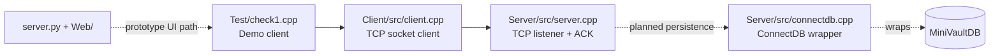
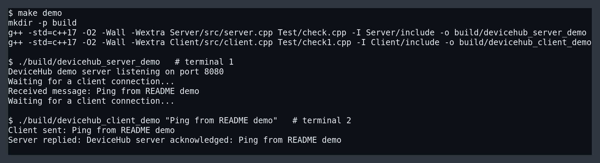

# DeviceHub

DeviceHub is a local-first prototype for device-to-device messaging. The current codebase proves a narrow, working path: a C++ client connects to a C++ server over TCP, sends a message, and receives a delivery acknowledgement. Around that core, the repo also contains early experiments for JSON-backed client state, a Flask/HTML chat shell, and a planned persistence hook via MiniVaultDB.

## What It Does

- Demonstrates a local client/server message exchange over sockets.
- Experiments with client-side unique IDs and message-history loading.
- Includes placeholder entry points for media sharing and richer session flows.
- Includes a small web prototype (`server.py` + `Web/`) that is not the verified demo path yet.

## Why I Built This
I built DeviceHub to understand low-level networking, socket programming, concurrency, and how messaging systems can evolve into persistent communication platforms.


## Key Learnings
- TCP socket lifecycle and connection handling
- Client/server architecture design
- Separating verified features from planned features
- Integrating storage layers into network systems


## Current Status

The code is best described as a messaging prototype, not a finished collaboration platform.

- Verified end-to-end today: local message send -> server receive -> acknowledgement reply.
- Partially scaffolded: unique IDs, message-history JSON loading, database wrapper code.
- Not fully implemented end-to-end: authentication, session management, file/media sharing.

## Resume-Safe Bullet

Built a C++ socket-based DeviceHub prototype that demonstrates local client/server message delivery, with exploratory Flask UI and persistence scaffolding for future chat history storage.

## Architecture



### Component Notes

- `Client/src/client.cpp`: low-level socket connection, send, receive, disconnect.
- `Server/src/server.cpp`: listens on port `8080`, accepts a client, logs the message, returns an acknowledgement.
- `Server/src/connectdb.cpp`: early wrapper around MiniVaultDB; not used by the verified demo path.
- `Client/src/clientfeature.cpp`: higher-level messaging/media feature ideas, currently incomplete.
- `server.py` and `Web/`: lightweight web shell for experimentation, separate from the working CLI demo.

## Tech Stack

- C++17
- POSIX sockets
- Make
- Flask
- HTML / CSS / JavaScript
- `nlohmann/json`
- MiniVaultDB integration scaffold

## Folder Structure

```text
DeviceHub/
├── Client/
│   ├── include/
│   └── src/
├── Server/
│   ├── include/
│   └── src/
├── Test/
│   ├── check.cpp      # demo server entry point
│   └── check1.cpp     # demo client entry point
├── Web/               # prototype browser UI
├── docs/
│   └── devicehub-demo.png
├── Makefile
└── server.py
```

## Build and Run

### Prerequisites

- `g++` with C++17 support
- `make`
- Linux or another POSIX-like environment with socket support

### Build the demo binaries

```bash
make demo
```

This creates:

- `build/devicehub_server_demo`
- `build/devicehub_client_demo`

### Run the verified demo flow

Terminal 1:

```bash
./build/devicehub_server_demo
```

Terminal 2:

```bash
./build/devicehub_client_demo "Ping from README demo"
```

Expected client output:

```text
Client sent: Ping from README demo
Server replied: DeviceHub server acknowledged: Ping from README demo
```

## Demo Flow

1. Start the demo server.
2. Launch the demo client with a message payload.
3. The client opens a TCP connection to `127.0.0.1:8080`.
4. The server receives the payload and prints it to the terminal.
5. The server sends an acknowledgement back to the client.
6. The client prints the acknowledgement and exits cleanly.

## Demo Screenshot



## Known Limitations

- The verified path is a single-message localhost demo, not a multi-user production system.
- Authentication and session management are not implemented end-to-end.
- `sendmedia()` and `getmedia()` are placeholders only.
- The web UI is a prototype shell and is not wired into the verified socket demo flow.
- The persistence wrapper exists, but durable chat storage is not part of the working demo path.
- Several source files still use hard-coded absolute include paths, which makes portability weaker than it should be.

## Future Work

- Wire the socket demo into a real message-routing layer with stable client identity handling.
- Replace placeholder media-sharing functions with actual file-transfer flows and permission checks.
- Connect the server receive path to MiniVaultDB-backed chat persistence and history retrieval.
- Remove absolute include paths and move to a portable build system.
- Unify the browser prototype with the C++ backend so the same flow works in both CLI and web entry points.
- Add automated tests for socket handshake, error handling, and message persistence.
